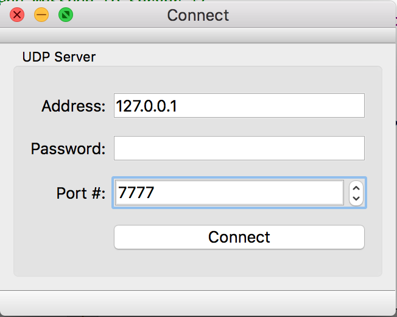
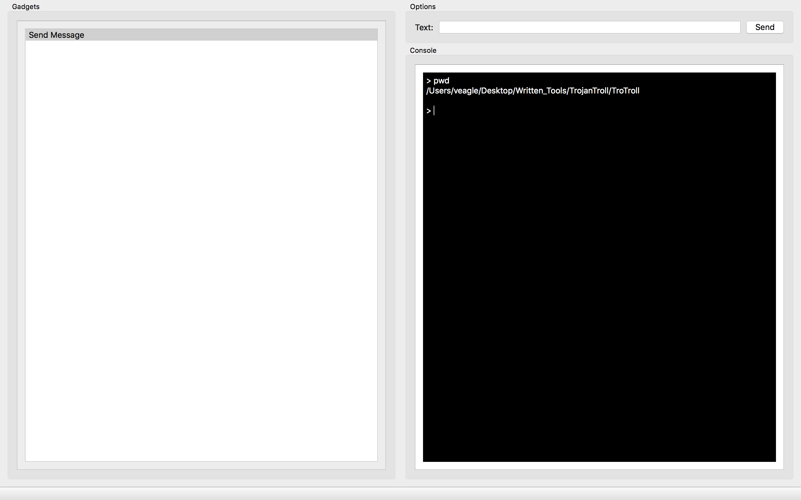

# TrojanTroll

Déjà je serait bien chaud à le faire en C++ sous Qt, ça nous laisserai beaucoup de possibilité pour améliorer le logiciel au cours du temps :)
Voici sur quoi on pourrait commencer:

* Faire une interface graphique en C++ sous Qt du logiciel "client"
* Faire un logiciel "server" mais juste en ligne de commande
* Quand on a les deux on veut pouvoir envoyer des instructions par UDP (pas TCP sinon on aura des problèmes plus tard) où le client envoi une chaine de char au server (genre pour l'instant la chaîne "1" pour la commande num. 1), le server la lis et execute la commande num. 1 du coup (par exemple on peut dire que la commande 1 exécute 'ls' sur le server) puis le server renvoi un string au client (QString dans Qt) contenant tout le résultat de la commande 'ls'. Enfin, le client pourra afficher la commande en mode dans une boite de dialogue ou un truc comme ça.

———

### Update: Vendredi 15 Juillet 2016

J'ai réussi à connecter les deux (server/client), on peut désormais envoyer des messages entre les deux.

### Update: Dimanche 17 Juillet 2016

On peut désormais envoyer des commandes entre les deux. Ce qui serait bien là ça serait de faire une interfce qui ouvre un terminal en mode invité de commande et qui affiche ça comme un shell.

### Update: Jeudi 21 Juillet 2016

J'ai refait l'interface client vite fait sous Qt. On peut maintenant se connecter:

Puis une nouvelle interface s'ouvre avec pas mal de choix à venir, plus une console interactive:

Il y a un problème avec la console mais je continuerai ça quand j'aurais le temps...
